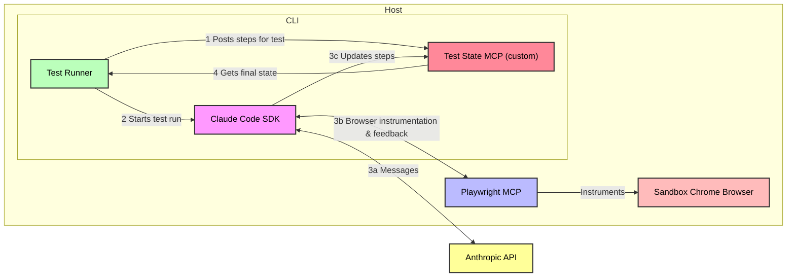

# Claude Code Test Runner

This project enables full E2E test automation using Claude Code.

Tests are defined using simple natural language steps.
Claude Code performs these steps sequentially in a browser through the Playwright MCP,
making decisions about element selection, timing,
and validation based on the test descriptions.

## Why Claude Code as a test runner?

Professional software engineers have been successfully writing automated tests for decades.
With the introduction of tools like Claude Code, traditional tests can be written even faster.
Why would anyone use Claude Code as a test runner?

First, this test runner was not made to replace traditional unit, integration, or manual testing strategies.
It is meant to bolster confidence in the final end-to-end experience of your web application.
Ideally, the Claude Code Test Runner sits somewhere between traditional automated E2E tests
and manual E2E sanity tests.

### Claude Code can execute tests like a real human

Imagine performing manual E2E tests with human-like intuition dozens or hundreds of times each day. That's what Claude Code Test Runner can deliver.

- **Natural language test definitions**: Tests describe what to test rather than how to test it
- **Visual understanding**: Can validate UI states based on visual appearance
- **Highly scalable**: Run as many tests as you are willing to pay for (requires Claude Code subscriptions or incurs API costs).

### Claude Code can roll with the punches

E2E tests typically tie together a large number of discrete systems.
A lot can happen in the span of a single test,
and it is difficult to write traditional E2E tests that account for every edge case. 

Claude Code is highly adaptive. It is not tripped up by network blips, minor UX updates, 
or other innocuous changes and hiccups. It's the perfect test runner for environments
where a lot can go wrong.

- **Adaptive element selection**: Finds elements based on context rather than fixed selectors
- **UI change adaptation**: When elements move or change appearance, Claude Code uses context and visual cues to locate them rather than failing on selector mismatches
- **Resilient to transient issues**: Claude Code can retry failed actions, wait for loading states, and handle network delays without explicit instructions

## Usage

### Test Definitions

Tests are defined in JSON using sequential, natural language steps.
The expected schema is a JSON array of [TestCase](cli/src/types/test-case.ts) objects.
See [samples/thisinto-e2e-tests.json](samples/thisinto-e2e-tests.json) for a concrete example.

### CLI

This project includes a CLI tool, `cc-test-runner`.

#### Building the CLI Tool

Initialize your environment: `cd cli && ./init.dev.sh`.

Build the CLI: `bun run build`

#### Running the CLI Tool

```bash
./dist/cc-test-runner [options]
```

| Argument | Alias | Type | Required | Default | Description |
|----------|-------|------|----------|---------|-------------|
| `--testsPath` | `-t` | string | Yes | - | Path to the JSON file containing test definitions |
| `--resultsPath` | `-o` | string | No | `./results` | Directory where test results will be saved |
| `--verbose` | `-v` | boolean | No | `false` | Enable verbose output including all Claude Code messages |
| `--maxTurns` | - | number | No | `30` | Maximum number of interactions Claude Code can make per test case |
| `--screenshots` | - | boolean | No | `false` | Whether to take screenshots upon completion of each test step. Note: this can significantly increase the number of tool calls made by Claude and slow test execution. |
| `--model` | `-m` | string | No | Claude Code default | Override the default model with one from https://docs.anthropic.com/en/docs/about-claude/models/overview. Depending on the complexity of the test case, Claude Haiku 3.5 can do a solid job. |

#### Example Commands

```bash
# Using configuration file
cc-test-runner

# Override config with CLI arguments
cc-test-runner --verbose

# Specify environment
cc-test-runner --environment production

# Traditional CLI usage (still works)
cc-test-runner -t ./tests.json -v

# With custom config file
cc-test-runner --config ./my-config.yaml
```

#### Running the Sample Tests

To test the sample `pdca-e2e-tests.json`:

```bash
# Navigate to the CLI directory
cd cli

# Build the test runner (if not already built)
./init.dev.sh
bun run build

# Run the sample tests
./dist/cc-test-runner --testsPath=./samples/pdca-e2e-tests.json

# Run with verbose output to see all Claude Code messages
./dist/cc-test-runner -t ./samples/pdca-e2e-tests.json -v

# Run with custom results directory
./dist/cc-test-runner -t ./samples/pdca-e2e-tests.json -o ./my-test-results
```

**Important**: Make sure the test target (`localhost:5173` in the sample) is running before executing the tests.

## Configuration

The test runner supports configuration files to simplify CLI usage and manage environment-specific settings.

### Configuration File

Create a configuration file at `config/cc-test.yaml`:

```bash
cc-test-runner config init
```

### Configuration Structure

```yaml
# Default configuration
default:
  tests:
    path: ./tests
    patterns:
      - "**/*.json"
    exclude:
      - "**/node_modules/**"

  execution:
    resultsPath: ./results
    verbose: false
    screenshots: false
    maxTurns: 30
    timeout: 300000

  claude:
    model: claude-sonnet-4-6

# Environment-specific overrides
environments:
  development:
    execution:
      verbose: true
      screenshots: true

  production:
    execution:
      maxTurns: 20
```

### Environment Detection

The test runner automatically detects the environment:

1. **CLI argument**: `--environment production`
2. **Environment variable**: `CC_TEST_ENV` or `NODE_ENV`
3. **Git branch**: `main/master` → production, `*dev*` → development
4. **Default**: development

### CLI Argument Priority

Command-line arguments override configuration file settings:

```bash
# Use config file settings
cc-test-runner

# Override specific settings
cc-test-runner --verbose --screenshots
```

### Configuration Commands

```bash
# Create sample configuration
cc-test-runner config init

# Validate configuration
cc-test-runner config validate

# Show current configuration
cc-test-runner config show

# Show configuration for specific environment
cc-test-runner config show --environment production
```

### Backward Compatibility

Configuration files are optional. The test runner works with command-line arguments only, maintaining full backward compatibility.

#### Viewing Test Results

After test execution completes, results are saved in the results directory (default: `./results`):

- **CTRF Format Report**: `./results/ctrf-report.json` - Machine-readable test results
- **Markdown Summary**: `./results/test-summary.md` - Human-readable test summary
- **Playwright Traces**: `./results/{test-case-id}/traces/` - Detailed browser traces for debugging
- **Screenshots**: `./results/{test-case-id}/*.png` - Screenshots captured at critical test points (if `--screenshots` is enabled)

Example result structure:
```
results/
├── ctrf-report.json
├── test-summary.md
└── login-test-case/
    ├── traces/
    │   └── trace.zip
    └── *.png
```

### Docker Image + GitHub Actions

The CLI described above is also bundled into a Docker container, available on GHCR.
This container can be used directly in GitHub actions, as demonstrated [here](.github/workflows/sample-tests-action.yml)

IMPORTANT: you must provide either an OAuth token or API key via the `CLAUDE_CODE_OAUTH_TOKEN` or `ANTHROPIC_API_KEY` env vars.

## Authentication Service

This project includes a comprehensive authentication microservice with email/password registration, MFA support, password reset, and administrative features.

### Features

- **Email/Password Authentication**: User registration with email verification
- **Multi-Factor Authentication (MFA)**: TOTP-based authenticator app support with 10 backup codes
- **Password Reset**: Email-based password recovery with time-limited tokens
- **Session Management**: Concurrent session limits, remember-me functionality, and session termination
- **Admin Controls**: Account suspension and reactivation with audit logging
- **Security Hardening**: Rate limiting, account lockout, security headers, and comprehensive audit logging
- **Accessibility**: WCAG 2.1 Level AA compliant authentication forms

### Architecture

The authentication service is a FastAPI-based microservice that integrates with the existing infrastructure:

```
Frontend → Nginx → Auth Service (Port 8010)
                ↓
            PostgreSQL (user_accounts, user_sessions, mfa_secrets, etc.)
                ↓
            Redis (rate limiting, session cache)
                ↓
            Celery Workers (email queue, maintenance jobs)
```

### Database Schema

The authentication service uses these core tables:
- `user_accounts`: User credentials, verification status, suspension state
- `user_sessions`: Active sessions with device tracking
- `mfa_secrets`: TOTP secrets and MFA status
- `recovery_codes`: One-time backup codes for MFA recovery
- `email_tokens`: Verification and password reset tokens
- `audit_logs`: Security event logging with 90-day retention

### Quick Start

1. **Start the services:**
   ```bash
   cd service/docker-compose
   docker-compose up -d postgres redis auth-service auth-service-worker auth-service-beat
   ```

2. **Run database migrations:**
   ```bash
   docker-compose exec auth-service alembic upgrade head
   ```

3. **Configure environment variables:**
   ```bash
   cp service/auth-service/.env.example service/auth-service/.env
   # Edit .env with your SMTP settings and secrets
   ```

4. **Access the API:**
   - API Documentation: http://localhost:8010/docs
   - Health Check: http://localhost:8010/health

### API Endpoints

**Authentication:**
- `POST /api/v1/auth/register` - User registration
- `POST /api/v1/auth/verify-email` - Email verification
- `POST /api/v1/auth/login` - User login
- `POST /api/v1/auth/logout` - User logout

**MFA:**
- `POST /api/v1/auth/mfa/setup` - Initiate MFA setup
- `POST /api/v1/auth/mfa/enable` - Enable MFA with verification
- `POST /api/v1/auth/mfa/disable` - Disable MFA
- `POST /api/v1/auth/mfa/verify` - Verify MFA code during login

**Password Management:**
- `POST /api/v1/auth/password/reset` - Request password reset
- `POST /api/v1/auth/password/reset/confirm` - Confirm password reset
- `POST /api/v1/auth/password/change` - Change password (authenticated)

**Session Management:**
- `GET /api/v1/auth/sessions` - List active sessions
- `DELETE /api/v1/auth/sessions` - Terminate session

**Admin (requires admin role):**
- `POST /api/v1/admin/users/{user_id}/suspend` - Suspend account
- `POST /api/v1/admin/users/{user_id}/reactivate` - Reactivate account

### Security Features

- **Rate Limiting**: Sliding window rate limiting on all authentication endpoints
- **Account Lockout**: 5 failed login attempts trigger 15-minute lockout
- **Session Limits**: Maximum 5 concurrent sessions per user
- **Password Requirements**: 8+ characters, mixed case, numbers, special characters
- **MFA Enforcement**: Optional TOTP-based multi-factor authentication
- **Security Headers**: HSTS, X-Content-Type-Options, X-Frame-Options, CSP
- **Audit Logging**: All security events logged with IP address and user agent

### Production Deployment

For production deployment, use the production Dockerfile:

```bash
# Build production image
docker build -f service/auth-service/Dockerfile.prod -t auth-service:prod service/auth-service/

# Run with production settings
docker run -d \
  --name auth-service \
  -p 8010:8010 \
  --env-file service/auth-service/.env.production \
  auth-service:prod
```

See `service/auth-service/.env.production.example` for required environment variables.

### Monitoring and Maintenance

- **Health Check**: `GET /health` returns service status
- **Email Queue**: Monitored via Celery worker logs
- **Audit Logs**: Automatic cleanup after 90 days
- **Session Cleanup**: Expired sessions removed every 6 hours

### Debugging and logs

The results directory for each test run contains the following:

- Overall test results:
    - CTRF format: `{results path}/ctrf-report.json`
    - Markdown: `{results path}/test-summary.md`
- Per test Playwright traces: `{results path}/{test case id}/traces`
- Per test screenshots taken by Claude Code at critical points of the test: `{results path}/{test case id}/*.png`

## Architecture



The system has three main components:

1. **Test Runner CLI**: Bun-based orchestrator that manages test execution.
2. **MCP Servers**: Model Context Protocol implementations for:
   - **Playwright MCP**: Provides browser automation capabilities through standard MCP tools
   - **Test State MCP**: A local HTTP server that maintains test execution state, tracks step completion, and enables Claude Code to query the current test plan and update progress in real-time
3. **Claude Code Integration**: Executes test steps using the Claude Code SDK

The Test State MCP server is particularly important as it provides a feedback loop between the test runner and Claude Code. 
It exposes two main tools:
- `get_test_plan`: Returns the current test case definition and step statuses
- `update_test_step`: Allows Claude Code to mark steps as passed/failed with error details

This architecture ensures Claude Code always knows what test it's executing and can report results back to the runner, 
enabling proper test orchestration and reporting.
